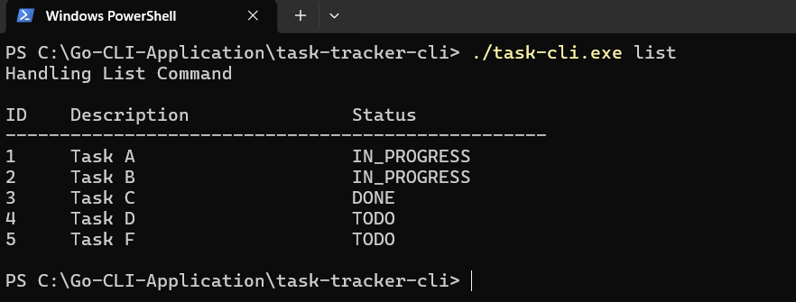

# Task Tracker CLI (Go)

A simple command-line task tracking application built in Go.
This tool helps you manage daily tasks directly from the terminal.

## Features

* Add tasks
* Update tasks
* Delete tasks
* Mark tasks as in progress
* Mark tasks as done
* List all tasks
* Filter tasks by status

## Installation

Clone the repository:

```
git clone https://github.com/NiteshSingh095/task-tracker-cli.git
cd task-tracker-cli
```

Build the CLI:

```
If you are using windows for this project than build command will be as given below:
go build -o task-cli.exe ./cmd

When you want to run it than , follow as below example:
./task-cli.exe add "Task A"
```

```
go build -o task-cli ./cmd
```

## Usage

Add a task:

```
task-cli add "Buy groceries"
```

Update a task:

```
task-cli update 1 "Buy groceries and cook dinner"
```

Delete a task:

```
task-cli delete 1
```

Mark task status:

```
task-cli mark-in-progress 1
task-cli mark-done 1
```

List tasks:

```
task-cli list
task-cli list done
task-cli list todo
task-cli list in-progress
```

## Task Storage

Tasks are stored in a `tasks.json` file in the current directory.

## Tech Stack

* Go (standard library only)
* JSON file storage

## Learning Outcomes

This project demonstrates:

* CLI design
* File system operations
* JSON handling
* Layered architecture
* Error handling
* Clean code practices

